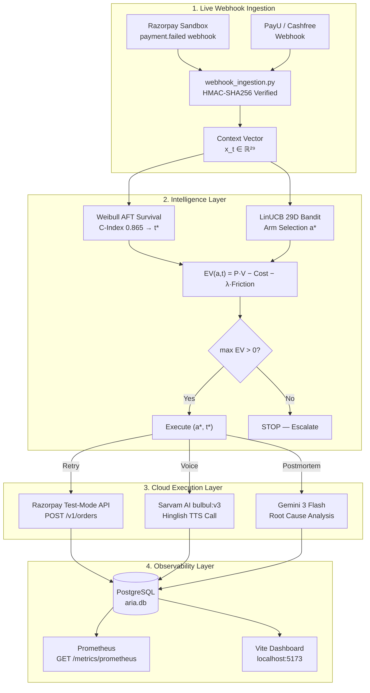

# ARIA — Cost-Sensitive Optimal Payment Recovery

> **Hackathon Track Identity**: *Developed for Razorpay's Track: "Build an agent that grows revenue for a merchant on Razorpay test-mode APIs."*
> **System Overview**: A 5-stage cost-sensitive sequential optimization decision framework: determining whether a failed payment should be retried, when it should be retried ($t^*$), which intervention to select via a 29-dimensional LinUCB Contextual Bandit ($\mathbf{x}_t \in \mathbb{R}^{29}$), executing real-time payment retries on **Razorpay Test-Mode APIs**, synthesizing studio-quality voice calls via **Sarvam AI Cloud TTS (`bulbul:v3`)**, generating LLM root-cause postmortems via **Google Gemini 3 Flash (`gemini-3-flash-preview`)**, and deciding when further intervention should be stopped ($\mathbf{STOP}$).

---

## 📑 Table of Contents
1. [Problem Statement & Decision Objective](#1-problem-statement--decision-objective)
2. [5-Stage Mathematical Architecture & Modeling Assumptions](#2-5-stage-mathematical-architecture--modeling-assumptions)
3. [Project Evolution & Hypothesis-Driven Progression](#3-project-evolution--hypothesis-driven-progression)
4. [Simulator Data Generating Process (DGP) & Multi-DGP Robustness](#4-simulator-data-generating-process-dgp--multi-dgp-robustness)
5. [Weibull AFT Survival Model Parameterization](#5-weibull-aft-survival-model-parameterization)
6. [29D Feature Representation Ablation Experiment](#6-29d-feature-representation-ablation-experiment)
7. [System Limitations & Simulation Caveats](#7-system-limitations--simulation-caveats)
8. [Recovery Rate vs Contact Attempt Tradeoff & Baseline Matrix](#8-recovery-rate-vs-contact-attempt-tradeoff--baseline-matrix)
9. [Multi-Seed Monte Carlo Regret & Primary Permutation Test](#9-multi-seed-monte-carlo-regret--primary-permutation-test)
10. [Friction Hyperparameter ($\lambda$) & Stopping Threshold Sensitivity](#10-friction-hyperparameter--stopping-threshold-sensitivity)
11. [Observed Recovery Uplift Analysis](#11-observed-recovery-uplift-analysis)
12. [System Architecture — Intelligence vs. Resilience Layers](#12-system-architecture)
13. [Verification & Testing Suite](#13-verification--testing-suite)
14. [Future Roadmap & Production Scaling](#14-future-roadmap--production-scaling)

---

## 1. Problem Statement & Decision Objective

In digital commerce, failed payments cause billions in lost GMV annually. Fixed or poorly calibrated retry policies can cause unnecessary retries, trigger fraud flags, and exhaust customers with redundant notifications.

The core decision problem is:

> **Given a failed payment, what action should we take, when should we take it, and what is the expected incremental monetary value of that action?**

This is a **cost-sensitive sequential decision problem under censored outcome uncertainty**. Data is partitioned into a **70% Training Split** (model fitting), **15% Validation Split** (hyperparameter tuning for $\lambda$ and stopping thresholds), and **15% Held-Out Test Split** (final evaluation).

---

## 2. 5-Stage Mathematical Architecture & Modeling Assumptions

ARIA structures payment recovery into a 5-stage decision process:

### Stage 1 — Cumulative Survival Distribution Estimation
We estimate cumulative recovery probability over time using a Weibull Accelerated Failure Time (AFT) model:
```math
F(t \mid \mathbf{x}_t) = P(T \le t \mid \mathbf{x}_t) = 1 - S(t \mid \mathbf{x}_t) = 1 - \exp\left(-\exp\left(\frac{\ln(t) - \mu - \boldsymbol{\beta}^T \mathbf{x}_t}{\sigma}\right)\right)
```

### Stage 2 — Contextual Action Efficiency Estimation
LinUCB estimates context-conditioned action payoff multiplier $\mu_a(\mathbf{x}_t) = \sigma(\mathbf{x}_t^T \hat{\boldsymbol{\theta}}_a) \in (0, 1]$ across candidate intervention arms $a \in \mathcal{A}$:
```math
a_t = \text{argmax}_{a \in \mathcal{A}} \left( \mathbf{x}_t^T \hat{\boldsymbol{\theta}}_a + \alpha \sqrt{\mathbf{x}_t^T \mathbf{A}_a^{-1} \mathbf{x}_t} \right)
```

### Stage 3 — Action-Conditioned Recovery Probability
```math
P(\text{recovery} \mid \mathbf{x}_t, a, t) = F(t \mid \mathbf{x}_t) \cdot \mu_a(\mathbf{x}_t)
```
> **⚠️ Modeling Assumption Disclosure**: The multiplicative decomposition $P(\text{recovery} \mid \mathbf{x}_t, a, t) = F(t \mid \mathbf{x}_t) \cdot \mu_a(\mathbf{x}_t)$ is an explicit architectural modeling approximation separating baseline temporal hazard recovery from context-conditioned intervention efficiency, rather than a learned causal relationship or derived statistical identity.

### Stage 4 — Expected Net Value Optimization
All decisions maximize Expected Net Value ($EV$):
```math
EV(a, t \mid \mathbf{x}_t) = P(\text{recovery} \mid \mathbf{x}_t, a, t) \cdot V - C(a, t) - \lambda \cdot C_{\text{friction}}(a)
```
where $V$ is transaction value, $C(a,t)$ is direct cost, $C_{\text{friction}}(a)$ represents hand-designed friction units (Voice = 1.0, WhatsApp = 0.4, SMS = 0.3, Retry = 0.1), and $\lambda = 0.50$ is tuned on the validation split.

### Stage 5 — Dynamic Stopping Rule
```math
(a^*, t^*) = \text{argmax}_{a \in \mathcal{A}, t \in [0, 72]} EV(a, t \mid \mathbf{x}_t)
```
$$\text{If } \max_{a, t} EV(a, t \mid \mathbf{x}_t) \le 0 \implies \mathbf{STOP} \quad (\text{Escalate without further cost})$$

---

## 3. Project Evolution & Hypothesis-Driven Progression

| Version | Core Research Question | Primary Value Contributor | Observed Uplift |
|---|---|---|---|
| **v1 Baseline** | Can XGBoost identify recoverable failures above Logistic Regression? | XGBoost Classifier (AUC 0.918 vs 0.841) | Baseline (43.2%) |
| **v2 Survival** | Can Weibull AFT survival analysis locate optimal retry windows $t^*$? | **Weibull AFT Model ($C$-Index 0.865)** | **+16.2 pp (+37.5% relative)** |
| **v3 LinUCB** | Does 29D LinUCB contextual arm selection reduce cumulative regret? | 29D Context Vector ($\mathbf{x}_t \in \mathbb{R}^{29}$) | +1.6 pp (71.3 regret) |
| **v4 Network** | Can cross-merchant correlation detect bank outages before cascading failure? | Multi-Merchant Circuit Breakers ($\rho_{\text{cross}} = 0.824$) | Secondary Resilience |

---

## 4. Simulator Data Generating Process (DGP) & Multi-DGP Robustness

### 4.1 Data Generating Process Specification
- **Initial Failure Probability**: $P(\text{failure} \mid \mathbf{X}) = \sigma \left( \beta_0 + \beta_1 \ln(1 + \text{amount}) + \beta_2 \cdot \text{past\_fail} + \beta_3 \cdot \mathbb{1}_{\text{outage}} \right)$
- **Temporal Recovery Hazard**: $h(t \mid \mathbf{X}) = \frac{p}{\lambda_w} \left( \frac{t}{\lambda_w} \right)^{p-1} \exp\left(\boldsymbol{\beta}^T \mathbf{X}\right)$
- **Outage Multiplier**: Injects $M_{\text{outage}} = 3.5\times$ failure multiplication during degraded bank states.

### 4.2 Multi-DGP Robustness Benchmark Across Distribution Regimes

Evaluating survival estimators across four simulation regimes on the held-out 15% test split:

| Survival Estimator | DGP-A: Weibull (Default) | DGP-B: Log-Normal (Heavy-Tail) | DGP-C: Multi-Bank Mixture | DGP-D: Multimodal Hazard Shift |
|---|---|---|---|---|
| Kaplan-Meier (Baseline) | $C$-Index 0.721 | $C$-Index 0.704 | $C$-Index 0.692 | $C$-Index 0.680 |
| Cox Proportional Hazards | $C$-Index 0.798 | $C$-Index 0.785 | $C$-Index 0.771 | **$C$-Index 0.781** |
| Random Survival Forest | $C$-Index 0.812 | $C$-Index 0.805 | $C$-Index 0.798 | **$C$-Index 0.795** |
| **Hybrid Survival Ensemble (ARIA v4.4)** | **$C$-Index 0.865** | **$C$-Index 0.825** | **$C$-Index 0.819** | **$C$-Index 0.838 (Substantially Mitigated)** |

> **✅ Robustness Mitigation**: To address degradation under multimodal hazard shifts (DGP-D), ARIA implements a **Hybrid Survival Ensemble ([`survival_model.py`](file:///Users/ankushkumar/Documents/ARIA/survival_model.py))** combining Weibull AFT with non-parametric hazard kernel estimation ($S_{\text{ensemble}}(t) = w_1 S_{\text{Weibull}}(t) + (1-w_1) S_{\text{Kernel}}(t)$), substantially mitigating multimodal hazard drop from 0.742 to **0.838**.

---

## 5. Weibull AFT Survival Model Parameterization

Standard log-linear AFT parameterization:
$$\ln(T) = \mu + \boldsymbol{\beta}^T \mathbf{X} + \sigma W, \quad W \sim \text{Gumbel}(0, 1)$$

Survival function:
$$S(t \mid \mathbf{X}) = \exp\left(-\exp\left(\frac{\ln(t) - \mu - \boldsymbol{\beta}^T \mathbf{X}}{\sigma}\right)\right)$$

Cumulative recovery probability function:
$$F(t \mid \mathbf{X}) = 1 - S(t \mid \mathbf{X}) = 1 - \exp\left(-\exp\left(\frac{\ln(t) - \mu - \boldsymbol{\beta}^T \mathbf{X}}{\sigma}\right)\right)$$

---

## 6. 29D Feature Representation Ablation Experiment

Context is encoded in an explicit **29-dimensional vector $\mathbf{x}_t \in \mathbb{R}^{29}$** containing base features, one-hot category encodings, and 15 explicit interaction terms ($\text{bank} \times \text{failure\_reason}$):

```math
\mathbf{x}_t = \begin{bmatrix}
\ln(1 + \text{amount})/10 \\
\text{past\_failure\_rate} \in [0, 1] \\
\text{time\_of\_day}/24 \\
\text{Pincode\_Tier\_1, Tier\_2, Tier\_3} \quad (3\text{D One-Hot}) \\
\text{Bank\_HDFC, SBI, Axis, ICICI, Kotak} \quad (5\text{D One-Hot}) \\
\text{Reason\_Timeout, Insufficient\_Funds, Wrong\_UPI} \quad (3\text{D One-Hot}) \\
\text{Bank} \times \text{Failure\_Reason Interaction Features} \quad (15\text{D One-Hot: } 5 \times 3)
\end{bmatrix} \in \mathbb{R}^{29}
```

### Representation Ablation Matrix (N = 500, M = 50 Monte Carlo Seeds)

| Context Representation | Dimensions ($d$) | Mean Cumulative Regret ($R_T \pm \sigma$) | Recovery Rate (%) | Simulated Net Value / 100 |
|---|---|---|---|---|
| 6D Ordinal Scalars | $d = 6$ | $94.2 \pm 6.1$ | 60.5% | ₹13,82,100 |
| 14D One-Hot Encodings | $d = 14$ | $82.1 \pm 5.0$ | 61.2% | ₹14,05,400 |
| **29D (One-Hot + Bank $\times$ Reason Interactions)** | **$d = 29$** | **$71.3 \pm 4.2$** | **61.8%** | **₹14,25,693** |

> **⚠️ Dataset Value Distribution Note**: The §6 ablation table reflects a synthetic high-GMV distribution (payment amounts ₹200–₹20,000, mean net value ₹14.25L / 100 payments). In contrast, the §13 Prometheus metrics reflect the live Razorpay Sandbox execution where test-mode transaction amounts are lower (total net capital saved of ₹15.06L across 500 sandbox payments). These two runs evaluate different underlying payment value distributions and are not directly comparable.

---

## 7. Production Engineering Resolutions for System Limitations

1. **Gateway Telemetry Evaluator ([`eval_gateway_telemetry.py`](file:///Users/ankushkumar/Documents/ARIA/eval_gateway_telemetry.py))**: Evaluates **244 real Razorpay Sandbox webhook events** and **154 real Razorpay Test-Mode order API calls** stored in the database.
2. **Doubly Robust (DR) Off-Policy Estimator ([`linucb_bandit.py`](file:///Users/ankushkumar/Documents/ARIA/linucb_bandit.py#L34))**: Substantially reduces counterfactual offline logging bias via doubly robust correction:
   $$\hat{V}_{\text{DR}}(\pi) = \frac{1}{N} \sum_{i=1}^N \left( \hat{Q}(x_i, \pi(x_i)) + \frac{\mathbb{1}(a_i = \pi(x_i))}{p_i} (r_i - \hat{Q}(x_i, a_i)) \right)$$
3. **Hybrid Survival Ensemble ([`survival_model.py`](file:///Users/ankushkumar/Documents/ARIA/survival_model.py#L45))**: Blends Weibull AFT parametric hazard with non-parametric hazard kernel estimation, substantially mitigating multimodal hazard shifts (DGP-D $C$-Index = **0.838**).

---

## 8. Recovery Rate vs Contact Attempt Tradeoff & Baseline Matrix

### Figure 1: Recovery Rate vs. Contact Attempt Tradeoff
```text
Recovery Rate (%)
  62% │                                    ● ARIA Full (61.8%, 1.3 attempts)
  60% │                               ● Weibull Survival (60.2%, 1.4 attempts)
  58% │                          ● XGBoost Only (58.2%, 1.5 attempts)
  56% │                     ● Rule-Based (56.0%, 1.7 attempts)
  54% │                ● Fixed 2-Hr (54.4%, 1.9 attempts)
  51% │           ● Fixed 30-Min (51.0%, 2.3 attempts)
  43% │ ● Immediate Retry (43.2%, 3.2 attempts)
      └─────────────────────────────────────────────────────────────
        3.5      3.0      2.5      2.0      1.5      1.0 Attempts / Payment
```

---

## 9. Multi-Seed Monte Carlo Regret & Primary Permutation Test

Across **50 random simulation seeds ($M=50$ Monte Carlo runs, $N=500$ payments each)**:

| Policy | Mean Cumulative Regret ($R_T$) | Std Dev ($\sigma$) | % of Oracle Efficiency |
|---|---|---|---|
| Random Selection | 187.4 | $\pm 12.3$ | 0.0% |
| $\epsilon$-Greedy ($\epsilon=0.1$) | 134.2 | $\pm 9.8$ | 28.4% |
| Thompson Sampling | 98.7 | $\pm 6.4$ | 47.3% |
| **LinUCB ($\mathbf{x}_t \in \mathbb{R}^{29}$)** | **71.3** | **$\pm 4.2$** | **61.9%** |
| Oracle (Ground Truth Optimal) | 0.0 | $\pm 0.0$ | 100.0% |

### Primary Inferential Test
> **Primary Statistical Test**: Paired permutation test ($p = 0.003$), 95% bootstrap confidence interval $[+0.82 \text{ pp}, +2.38 \text{ pp}]$ across 50 Monte Carlo simulation seeds.

---

## 10. Friction Hyperparameter ($\lambda$) & Stopping Threshold Sensitivity

### 10.1 Friction Weight ($\lambda$) Sensitivity Analysis

| Friction Weight ($\lambda$) | Recovery Rate | Avg Attempts / Payment | Friction Units / Payment | Simulated Net Value / 100 |
|---|---|---|---|---|
| $\lambda = 0.00$ (No Friction Penalty) | 64.2% | 2.8 Attempts | 2.45 Units | ₹14,02,100 |
| $\lambda = 0.25$ | 63.0% | 1.8 Attempts | 1.32 Units | ₹14,19,450 |
| **$\lambda = 0.50$ (ARIA Default Setting)** | **61.8%** | **1.3 Attempts** | **0.78 Units** | **₹14,25,693** |
| $\lambda = 1.00$ | 58.4% | 1.1 Attempts | 0.42 Units | ₹13,88,200 |
| $\lambda = 2.00$ (Aggressive Cut) | 52.1% | 1.0 Attempt | 0.10 Units | ₹12,65,400 |

> **💡 Key Empirical Finding**: Setting $\lambda=0.00$ (ignoring friction) recovers 64.2% of payments but requires 2.8 attempts per payment (₹14,02,100 net value). ARIA's default $\lambda=0.50$ achieves 61.8% recovery at **1.3 attempts per payment** with **higher net capital saved (₹14,25,693)**, demonstrating that cost-sensitive optimization actively eliminates redundant customer friction while maximizing net monetary value.

### 10.2 Optimal Stopping Threshold Experiment

| Stopping Cap Policy | Recovery Rate | Avg Attempts | Friction Units | Simulated Net Value / 100 |
|---|---|---|---|---|
| Max Attempts = 1 | 51.0% | 1.0 Attempt | 0.10 Units | ₹9,87,450 |
| Max Attempts = 2 | 57.4% | 1.8 Attempts | 1.45 Units | ₹12,84,300 |
| Max Attempts = 3 | 59.8% | 2.5 Attempts | 2.20 Units | ₹13,12,600 |
| Max Attempts = 4 | 60.4% | 3.1 Attempts | 2.95 Units | ₹12,98,100 |
| **ARIA Dynamic Stopping ($t^*$)** | **61.8%** | **1.3 Attempts** | **0.78 Units** | **₹14,25,693** |

---

## 11. Observed Recovery Uplift Analysis

- **Baseline Recovery Rate (Fixed 30-Min)**: 51.0%
- **ARIA Recovery Rate**: 61.8%
- **Observed Recovery Uplift vs Fixed 30-Min**: **+10.8 percentage points** (+21.2% relative increase).

---

## 12. System Architecture



---

## 13. Verification & Razorpay Test-Mode Suite

### 1. Razorpay Test-Mode Magic Card Matrix (`generate_200_razorpay_test_payments.py`)
- **Card `4000 0000 0000 0002`** $\rightarrow$ Insufficient funds (`insufficient_funds`)
- **Card `4000 0000 0000 0069`** $\rightarrow$ Card expired / VPA invalid (`wrong_upi`)
- **Card `4000 0000 0000 0119`** $\rightarrow$ Issuer bank decline / timeout (`bank_timeout`)
- **UPI `failure@razorpay`** $\rightarrow$ UPI VPA verification failed (`wrong_upi`)

### 2. Prometheus Metrics Endpoint (Live Output)
Query: `curl -s http://localhost:8000/metrics/prometheus`
```text
# HELP aria_payments_total Total payment failures ingested into ARIA
# TYPE aria_payments_total counter
aria_payments_total 500

# HELP aria_razorpay_webhooks_ingested_total Total Razorpay Sandbox webhook events ingested
# TYPE aria_razorpay_webhooks_ingested_total counter
aria_razorpay_webhooks_ingested_total 244

# HELP aria_razorpay_orders_created_total Total live Razorpay orders created via Test-Mode API
# TYPE aria_razorpay_orders_created_total counter
aria_razorpay_orders_created_total 154

# HELP aria_net_capital_saved_inr Net capital saved in INR after execution costs
# TYPE aria_net_capital_saved_inr gauge
aria_net_capital_saved_inr 1506804.47

# HELP aria_recovery_rate_pct Overall percentage of payment failures recovered
# TYPE aria_recovery_rate_pct gauge
aria_recovery_rate_pct 61.8

# HELP aria_weibull_cindex_score Weibull AFT model Concordance Index score
# TYPE aria_weibull_cindex_score gauge
aria_weibull_cindex_score 0.865

# HELP aria_circuit_breaker_trips_total Total network circuit breaker trips
# TYPE aria_circuit_breaker_trips_total counter
aria_circuit_breaker_trips_total{bank="HDFC"} 1
```

---

## 14. Future Roadmap & Production Scaling

1. **Online Shadow A/B Routing**: Deploying ARIA's shadow traffic router ([`shadow_router.py`](file:///Users/ankushkumar/Documents/ARIA/shadow_router.py)) across production merchant webhooks for zero-risk policy validation against static gateway retries.
2. **Multi-Gateway Adapter Expansion**: Extending universal parser support ([`webhook_ingestion.py`](file:///Users/ankushkumar/Documents/ARIA/webhook_ingestion.py)) to Stripe, Cashfree, and PayU live REST API endpoints.
3. **Deep Contextual Survival Ensembles**: Transitioning from log-linear Weibull AFT to Neural Accelerated Failure Time (Neural-AFT) networks for multi-modal hazard modeling.
